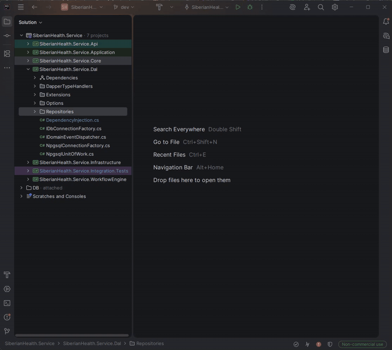
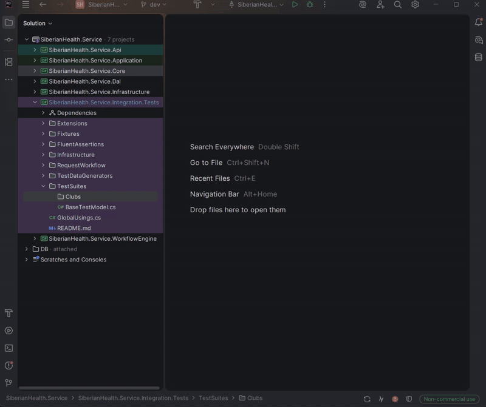
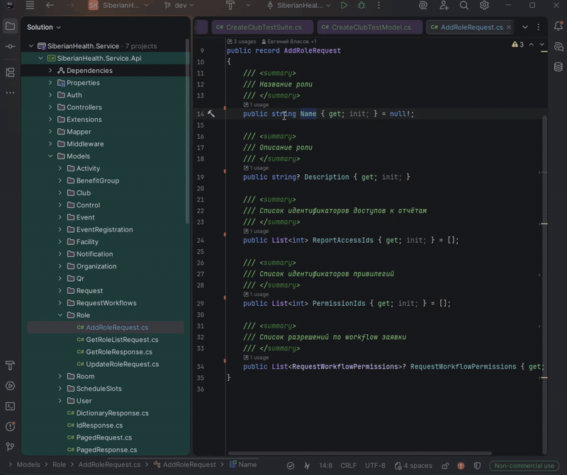

Rider плагин для автоматической генерации кода ![Language][csharp_badge] [![Platform][resharper_badge]][resharper_sdk]
===============================
Плагин, упрощающий мою разработку в части написания шаблонного кода и выполнения рутинных действий.

### Репозиторий
Генерация класса-репозитория или части из его методов



### Тест-кейсы
Suite, Model, Case и Theory классы



### Атрибуты `JsonPropertyName` и `FromQuery`
Быстро добавление публичным свойствам класса



Разработан на основе:
- [ForNeVeR / JetBrains Rider plugin template][rider_plugin_template]
- [ReSharper Platform SDK][resharper_sdk]
- [IntelliJ Platform SDK][intellij_sdk]

## Установка
Через [кастомный репозиторий][custom_repo_doc] плагинов установить плагин с наименованием **RiderCodeGen**
```url
https://storage.fi.exios.site/jetbrains-plugins/plugin-list.xml
```


[docs.ru_RU]: README.md
[docs.en_US]: README.en_US
[custom_repo_doc]: https://www.jetbrains.com/help/idea/managing-plugins.html#repos
[resharper_sdk]: https://www.jetbrains.com/help/resharper/sdk/welcome.html
[intellij_sdk]: https://plugins.jetbrains.com/docs/intellij/welcome.html
[rider_plugin_template]: https://github.com/ForNeVeR/rider-plugin-template
[csharp_badge]: https://img.shields.io/badge/C%23-orange
[resharper_badge]: https://img.shields.io/badge/Platform-ReSharper_SDK-f90256
